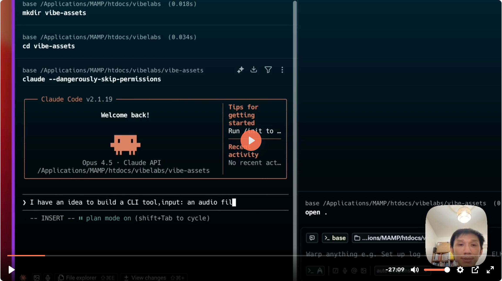

# wavevid

Turn your podcast or audio into stunning waveform videos with avatar, subtitles, and intro/outro — ready for social media.



## Features

- **5 visualization styles** — waveform, radial, bars, spectrum, particles
- **Auto-generated subtitles** — via Soniox speech-to-text
- **Intro/outro** — with title overlay, custom sounds, and fade transitions
- **Background music** — loops throughout with adjustable volume
- **Smart color detection** — auto-picks wave/subtitle colors from background
- **Social media presets** — 16:9, 9:16, 1:1, 4:5 aspect ratios
- **End screen** — auto-generated with avatar and title

## Install

```bash
pip install wavevid
```

Or install from source:
```bash
git clone https://github.com/tf-vip/wavevid.git
cd wavevid
pip install -e .
```

**Requires:** FFmpeg (`brew install ffmpeg` on macOS, `apt install ffmpeg` on Ubuntu)

## Quick Start

```bash
# Basic waveform video
wavevid audio.m4a -o video.mp4

# Square video with avatar for social media
wavevid audio.m4a -o video.mp4 --aspect 1:1 --avatar photo.jpg

# Full-featured podcast video
wavevid podcast.m4a -o podcast.mp4 \
  --style radial \
  --bg random \
  --avatar host.jpg \
  --subtitle \
  --intro intro.wav \
  --intro-title "My Podcast" \
  --bg-music jazz.mp3
```

## Options

### Video

| Option | Default | Description |
|--------|---------|-------------|
| `-o, --output` | output.mp4 | Output file |
| `--aspect` | - | Preset: `16:9`, `9:16`, `1:1`, `4:5` |
| `--width` | 1920 | Video width (if no aspect) |
| `--height` | 1080 | Video height (if no aspect) |
| `--fps` | 30 | Frames per second |
| `--preset` | ultrafast | Encoding: `ultrafast` to `veryslow` |
| `--thumbnail` | - | Save thumbnail image |

### Visualization

| Option | Default | Description |
|--------|---------|-------------|
| `--style` | waveform | `waveform`, `radial`, `bars`, `spectrum`, `particles` |
| `--bg` | color | `color`, `gradient`, `image`, `random` |
| `--bg-value` | #1a1a2e | Hex, "color1,color2", or image path |
| `--wave-color` | #00ff88 | Hex or `auto` (detect from background) |
| `--wave-sync` | 0 | Sync offset in seconds |

### Avatar & Subtitles

| Option | Default | Description |
|--------|---------|-------------|
| `--avatar` | - | Avatar image (centered, circular) |
| `--avatar-size` | auto | Size in pixels |
| `--subtitle` | off | Enable transcription |
| `--subtitle-color` | auto | Hex or `auto` |
| `--subtitle-font-size` | auto | Font size in pixels |
| `--replace` | - | Text replacement: `old=new` |
| `--replace-file` | - | File with replacements |

### Audio

| Option | Default | Description |
|--------|---------|-------------|
| `--volume` | 100 | Main audio volume % |
| `--intro` | - | Intro sound file |
| `--intro-duration` | 3 | Intro solo duration (seconds) |
| `--outro` | - | Outro sound file |
| `--bg-music` | - | Background music (loops) |
| `--bg-music-volume` | 15 | Background music volume % |
| `--audio-only` | - | Output audio mix only |

### Intro Clip

| Option | Default | Description |
|--------|---------|-------------|
| `--intro-title` | - | Title text overlay |
| `--intro-subtitle` | - | Subtitle below title |
| `--intro-bg` | - | Intro background (image or video) |
| `--intro-clip-duration` | 3 | Intro clip length (seconds) |
| `--intro-static` | animated | Static intro (better thumbnails) |
| `--intro-title-color` | auto | Hex or `auto` |

### End Screen

| Option | Default | Description |
|--------|---------|-------------|
| `--end-screen` | auto | Enable end screen |
| `--end-screen-duration` | 5 | Duration in seconds |

## Examples

### Podcast with everything
```bash
wavevid episode.m4a -o episode.mp4 \
  --style radial \
  --aspect 1:1 \
  --bg random \
  --wave-color auto \
  --avatar host.jpg \
  --subtitle \
  --subtitle-color auto \
  --intro intro.wav \
  --intro-title "Episode 42" \
  --intro-subtitle "The Answer to Everything" \
  --outro outro.wav \
  --bg-music lofi.mp3 \
  --bg-music-volume 10
```

### Instagram Reels (9:16)
```bash
wavevid clip.m4a -o reel.mp4 \
  --style bars \
  --aspect 9:16 \
  --bg gradient \
  --bg-value "#667eea,#764ba2" \
  --avatar photo.jpg
```

### Audio mix only (no video)
```bash
wavevid podcast.m4a -o mixed.m4a \
  --audio-only \
  --intro intro.wav \
  --outro outro.wav \
  --bg-music jazz.mp3
```

### High quality export
```bash
wavevid audio.m4a -o video.mp4 \
  --preset slow \
  --fps 60
```

## Subtitles

Subtitles use [Soniox API](https://soniox.com) for transcription.

1. Get API key from https://console.soniox.com
2. Create `.env` file:
   ```
   SONIOX_API_KEY=your_key_here
   ```
3. Run with `--subtitle`

Transcripts are cached in `.transcribe_cache/` to avoid repeated API calls.

### Text Replacements

Fix transcription errors with `--replace` or `--replace-file`:

```bash
# Single replacement
wavevid audio.m4a -o video.mp4 --subtitle --replace "AI=A.I."

# Multiple from file
wavevid audio.m4a -o video.mp4 --subtitle --replace-file fixes.txt
```

`fixes.txt`:
```
AI=A.I.
gonna=going to
# comments are ignored
```

## Social Media Specs

| Platform | Ratio | Resolution | Aspect Flag |
|----------|-------|------------|-------------|
| YouTube | 16:9 | 1920×1080 | `--aspect 16:9` |
| Instagram Feed | 1:1 | 1080×1080 | `--aspect 1:1` |
| Instagram/TikTok | 9:16 | 1080×1920 | `--aspect 9:16` |
| Facebook Feed | 4:5 | 1080×1350 | `--aspect 4:5` |

## Custom Backgrounds

Add images to `src/wavevid/backgrounds/` for `--bg random`, or use `--bg image --bg-value path/to/image.jpg`.

## License

MIT
